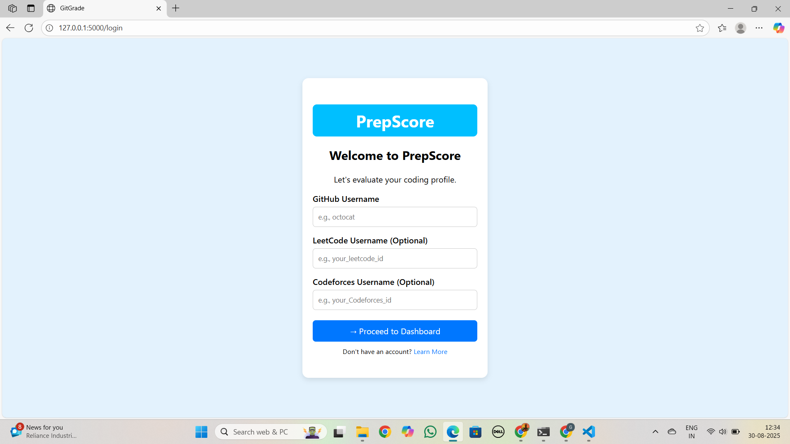
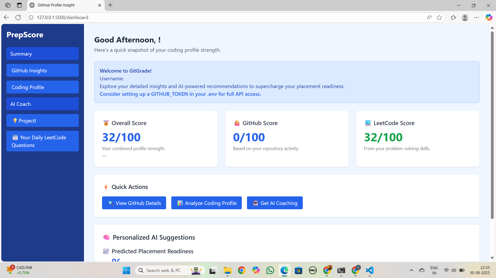
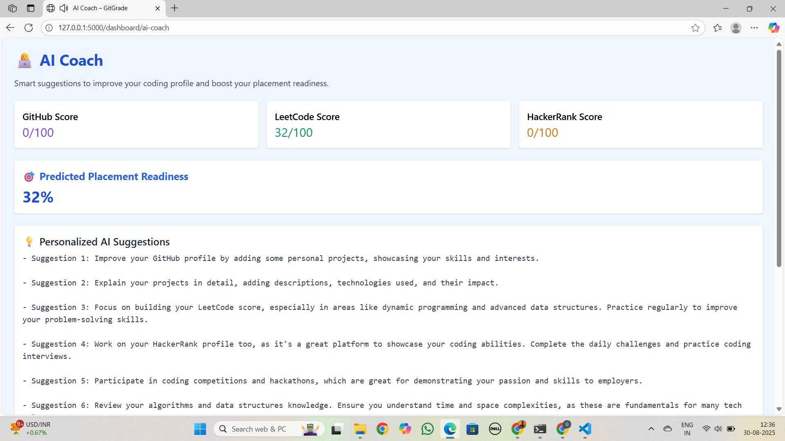
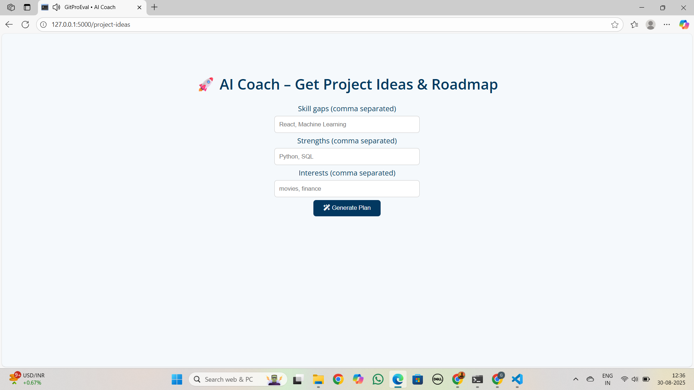
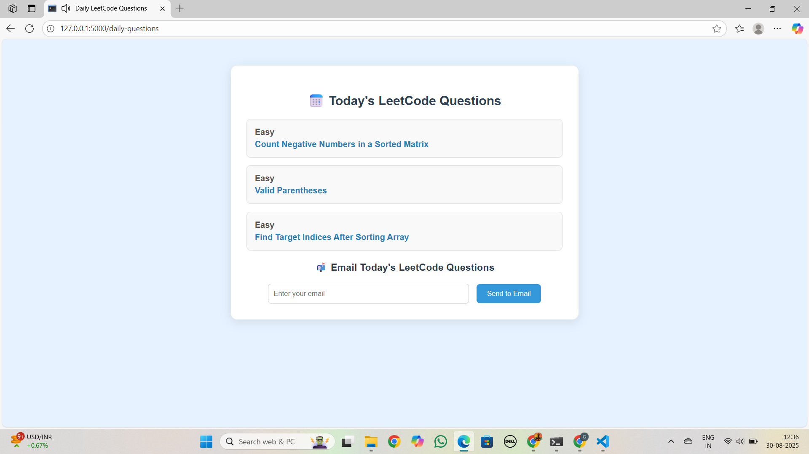

# 🚀 Git_Guide  

Git_Guide is an AI-powered platform that evaluates your **LeetCode** and **GitHub** performance daily.  
It provides personalized **AI recommendations**, **daily practice questions**, and tracks **placement readiness**.  

---

## ✨ Features
- 📊 Daily evaluation of your **LeetCode score** & **GitHub activity**
- 🤖 AI Recommendations for improvement
- 📅 Daily curated coding questions from LeetCode
- 🚀 Placement Readiness Score
- 💡 Project ideas & coding roadmap suggestions

---

## 🖥️ Tech Stack
- **Frontend:** HTML, CSS, JavaScript  
- **Backend:** Python / Flask (or update based on what you used)  
- **Database:** MySQL / SQLite  
- **AI/ML:** OpenAI API (or whichever you used)  

---

## 📸 Screenshots  

### 🏠 Landing Page  
  

### 🔑 Login / Profile Input  
  

### 📊 Dashboard – Coding Profile Insights  
  

### 🤖 AI Coach – Personalized Suggestions  
  

### 🚀 AI Coach – Project Ideas & Roadmap  
  

### 📅 Daily LeetCode Questions  
  

---

## ⚡ Getting Started  

### 1️⃣ Clone the repo  
```bash
git clone https://github.com/Pranithagotur/Git_Guide.git
cd Git_Guide
